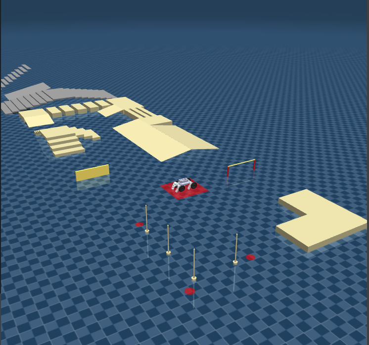
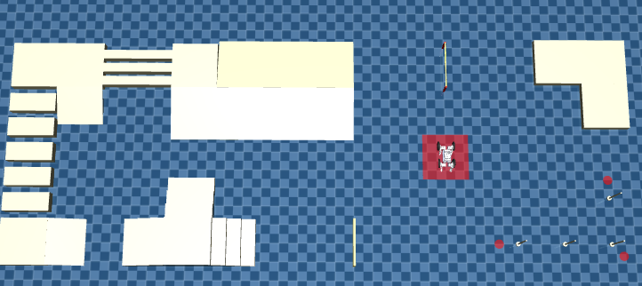
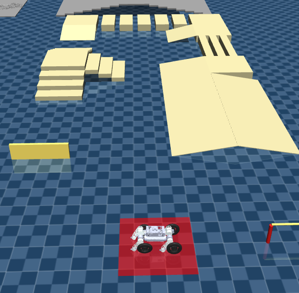

# RC_MAP

ROBOCON 仿生足式挑战赛地图。

## 地图预览

### 整体地图



### 地图俯视



### 地图侧面 



## 使用方法

在 MuJoCo 中替换 `scene_terrain.xml`，并在自己机器人模型中修改 `base` 出生位置为：

```xml
<worldbody>
    <body name="base_link" pos="3.7 -9.0 0.6">
```
